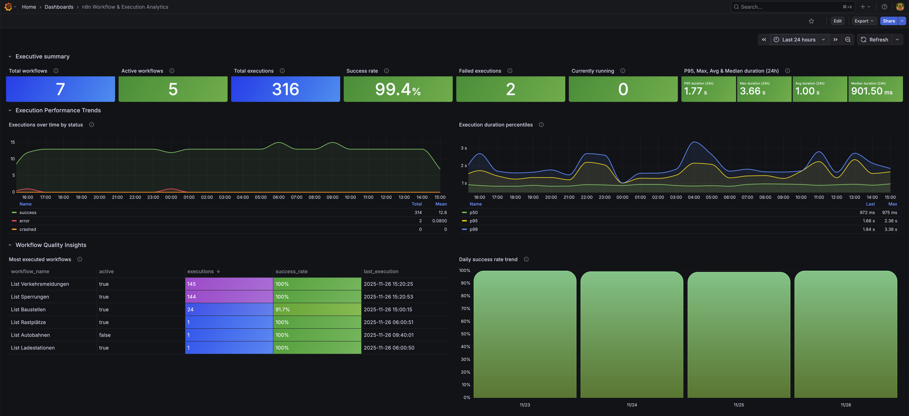
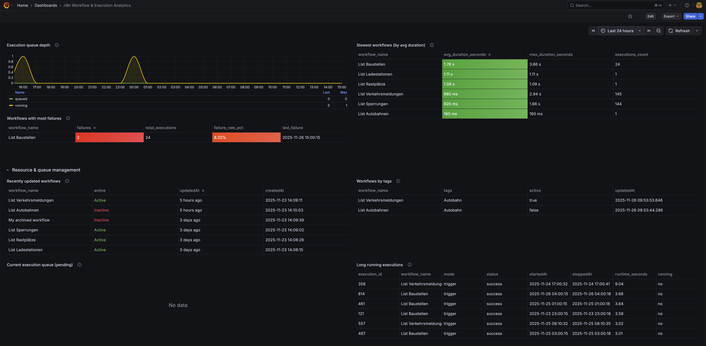

# n8n Workflow & Execution Analytics Dashboard

A Grafana dashboard for analyzing n8n workflow performance, execution patterns, queue behavior, and workflow quality — powered by the n8n PostgreSQL database.

## Overview

This dashboard provides detailed analytics for understanding how workflows run over time, identifying failures, spotting bottlenecks, and improving workflow design.  
It complements the **n8n System Health Overview** dashboard by focusing on workflow-level and business-level insights.




## Features

### Executive Summary
- Total workflows  
- Active workflows  
- Total executions  
- Success rate (with health indicators)  
- Failed executions  
- Currently running executions  

### Execution Performance
- Executions over time by status  
- Duration percentiles (P50, P95, P99)  
- 24h duration summary (Avg, Median, Max, P95)  

### Workflow Quality Insights
- Most executed workflows  
- Daily success rate trend  
- Workflows with most failures  
- Slowest workflows  

### Queue & Runtime Monitoring
- Execution queue depth  
- Current pending/active executions  
- Long-running executions  
- Recently updated workflows  
- Workflows by tags  
- Recent execution errors  

## Requirements

### Software
- **Grafana** 9.0+ (tested with 12.3+)  
- **n8n** with PostgreSQL backend  
- **PostgreSQL** 12+  

### Grafana Plugins
- Built-in PostgreSQL datasource

### Database Tables Required
- `workflow_entity`  
- `execution_entity`  
- `tag_entity`  
- `workflows_tags`

A read-only database user is recommended.

## Installation

### 1. Configure PostgreSQL Datasource
1. Go to **Configuration → Data Sources → Add data source**  
2. Select **PostgreSQL**  
3. Set:
```
Host: your-n8n-db:5432
Database: n8n
User: grafana_readonly
Password: your-password
SSL Mode: require
```
4. Save and note the datasource **UID**.

### 2. Import Dashboard

#### Option A: JSON Import
1. Download `n8n-workflow-execution-analytics.json`  
2. Go to **Dashboards → Import**  
3. Upload or paste JSON  
4. Select your PostgreSQL datasource  

#### Option B: Grafana.com Import
1. Go to **Dashboards → Import**  
2. Use ID: **24475**  
3. Select your PostgreSQL datasource  

## Dashboard Sections

### Executive Summary
Fast insight into workflow stability and performance, with color-coded thresholds indicating health.

### Performance Metrics
Identify trends, spikes, degradations, and latency distributions over time.

### Workflow Analysis
Sortable and exportable tables for identifying problematic or high-value workflows.

### Queue Management
Monitor queue buildup, long-running executions, and potential resource constraints.


